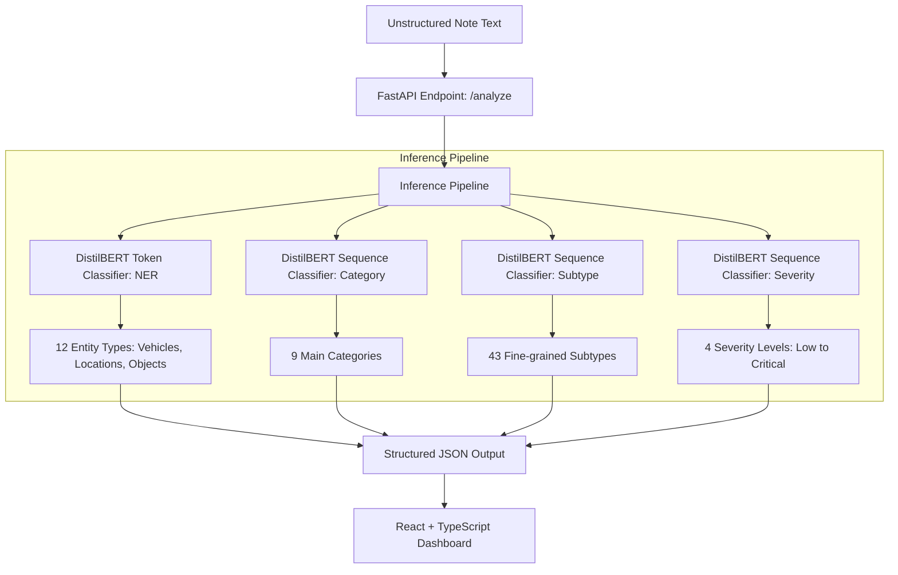

# Municipal Parking Violation NLP System

An end-to-end, multi-model text analytics system designed to parse, categorize, and extract structured violation details from unstructured parking patrol officer notes. 

The project features a **synthetic data generation pipeline** simulating field notes with domain-specific shorthands, a **four-model DistilBERT inference pipeline** (1 Named Entity Recognition model + 3 Sequence Classification models), and a **FastAPI backend** served to an interactive **React + TypeScript dashboard** for real-time note analysis.

---

## System Architecture

The following diagram illustrates the flow of unstructured note data through the cascaded inference pipeline to produce structured reporting:



---

## Core Components

### 1. Synthetic Data & Noise Generation Pipeline
To train and evaluate the models under realistic conditions, the system generates **100,000 synthetic records** using a slot-filling template engine that applies domain-specific shorthand and casual casing:
*   **Abbreviation Mapping (`ABBREVIATIONS`)**: Replaces standard words with haste-based officer shorthands (e.g., `parked` $\rightarrow$ `parkd`/`pk`, `vehicle` $\rightarrow$ `veh`/`vhcl`, `blocking` $\rightarrow$ `blk`, `emergency` $\rightarrow$ `emerg`).
*   **Informal Phrasing (`INFORMAL_PATTERNS`)**: Substitutes formal vocabulary with conversational jargon (e.g., `found` $\rightarrow$ `spotted`/`saw`, `parked` $\rightarrow$ `sitting`/`left`).
*   **NER Formatting**: Generates and aligns character offsets to save data in standard **IOB2 format (CoNLL representation)** for token classification.

### 2. Model Architecture
The system employs **four separate fine-tuned DistilBERT (`distilbert-base-uncased`) models**:
1.  **Named Entity Recognition (NER)**: Identifies 12 custom entities: `VEHICLE_TYPE`, `VEHICLE_BRAND`, `VEHICLE_COLOR`, `LICENSE_PLATE`, `ZONE_TYPE`, `LOCATION`, `TIME_PERIOD`, `VIOLATION_OBJECT`, `PERMIT_STATUS`, `REPEAT_STATUS`, `WEATHER`, and `ACTION`.
2.  **Violation Category Classifier**: Assigns the note to 1 of 9 main categories (e.g., `OBSTRUCTION`, `TRAFFIC_FLOW`, `RESTRICTED_AREAS`).
3.  **Violation Subtype Classifier**: Determines the exact violation subclass across 43 categories (e.g., `Fire Hydrant Blocking`, `Double Parking`).
4.  **Severity Classifier**: Calculates risk level (`Low`, `Medium`, `High`, `Critical`) using context clues like emergency vehicle impact, weather conditions, repeat offense status, and aggravating/mitigating factors.

### 3. FastAPI Web Server
Provides high-performance, single and batch inference capabilities:
*   **`POST /analyze`**: Analyzes a single note.
*   **`POST /analyze-batch`**: Processes lists of notes concurrently.
*   **`GET /`**: Diagnostic health checks.

### 4. React + TypeScript Dashboard
An interactive web application built with **Vite, React 18, TailwindCSS, and Shadcn UI** that enables patrol officers or administrators to paste raw logs and instantly visualize:
*   Color-coded text annotations for extracted entities (grouped by type).
*   Categorization results and fine-grained subtypes.
*   Dynamic severity badges matching safety thresholds.
*   Inference execution speed (latency in milliseconds).

---

## Model Evaluation & Performance

Evaluation was conducted on a stratified $10\%$ held-out test split of the generated dataset:

| Model / Task | Accuracy | F1-Score (Weighted) | Evaluation Note |
| :--- | :---: | :---: | :--- |
| **Violation Category** | $100.0\%$ | $1.000$ | Perfect separation on structured templates |
| **Violation Subtype** | $100.0\%$ | $1.000$ | Perfect separation on structured templates |
| **Severity Classification** | **$78.4\%$** | **$0.782$** | Realistic learning curve on composite multi-factor scoring |
| **Named Entity Recognition (NER)** | — | $1.000$ | Entity-level F1-score on vocabulary-restricted slots |

*Note: The perfect classification metrics for Category, Subtype, and NER represent deterministic mappings inside the synthetic generator templates. The **Severity Classification** task requires complex, multi-factor contextual reasoning, resulting in a more realistic and generalizable model performance of **$78.2\%$ F1-score**.*

---

## Local Setup & Run Guide

### Prerequisites
*   Node.js (v18+) and npm
*   Python 3.10+
*   PyTorch, Hugging Face Transformers

### Running the Backend API
1.  Navigate to the repository root.
2.  Install python dependencies:
    ```bash
    pip install torch transformers pandas scikit-learn joblib fastapi uvicorn seqeval
    ```
3.  Start the FastAPI server:
    ```bash
    python backend_api.py
    ```
    The API will be available at `http://localhost:8000`.

### Running the Frontend Dashboard
1.  Install node modules:
    ```bash
    npm install
    ```
2.  Start the Vite dev server:
    ```bash
    npm run dev
    ```
    Open `http://localhost:5173` in your web browser.

### Verifying Metrics Locally
To compute the metrics on the held-out splits on your local machine, run the custom evaluation script:
```bash
# Runs a quick subset evaluation (500 classification samples, 200 NER sentences)
python evaluate_local_models.py

# Runs full evaluation on the entire 10% test split (takes longer on CPU)
python evaluate_local_models.py --full
```
